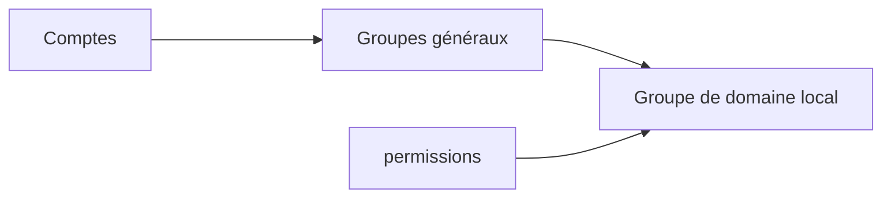
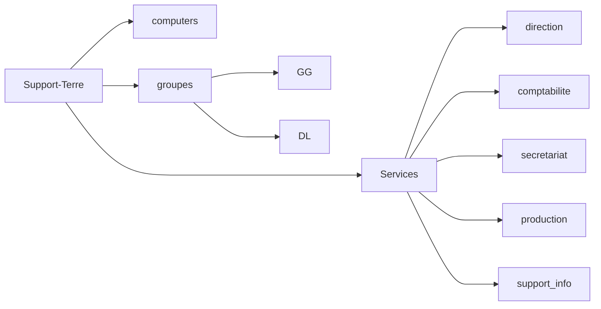

# Active Directory (AD)
## Configuration d'un nouvel AD

### Installation du rôle AD DS

Procéder à la configuration du serveur dns préféré dans la configuration TCP/IP

> Si dans les différentes étapes rien n'est spécifié, cliquer simplement sur "Suivant"

- Dans la fenêtre "Gestionnaire de serveur / Serveur Local" --> Gérer --> Ajouter des rôles et fonctionnalités
- Choisir l'installation basée sur un rôle ou une fonctionnalité
- Sélectionner un serveur du pool de serveur
- Cocher "Services AD DS"
- Confirmer et installer

### Promotion du serveur en contrôleur de domaine

Cliquer sur le drapeau contenant le point d'exclamation : 
- Promouvoir ce serveur en contrôleur de domaine (DC)
- Ajouter une nouvelle forêt
- Choisir un nom de domaine racine (ex: d0cs1s.lcl)
- Ici c'est un nouvel AD --> Laisser le niveau fonctionnel comme il est
- Laisser serveur DNS coché sauf si autre serveur DNS
- Choisir un mot de passe DSRM (Directory Service Recovery Mode)

Les options précédentes sont réalisables avec le script suivant :
```
#
# Script Windows PowerShell pour le déploiement d’AD DS
#

Import-Module ADDSDeployment
Install-ADDSForest `
-CreateDnsDelegation:$false `
-DatabasePath "C:\Windows\NTDS" `
-DomainMode "WinThreshold" `
-DomainName "d0cs1s.lcl" `
-DomainNetbiosName "d0cs1s" `
-ForestMode "WinThreshold" `
-InstallDns:$true `
-LogPath "C:\Windows\NTDS" `
-NoRebootOnCompletion:$false `
-SysvolPath "C:\Windows\SYSVOL" `
-Force:$true
```

### Ajouter une machine au domaine

Remplacer le domaine WORKGROUP par votre domaine et configurer le DNS préféré avec l'ip de l'AD

Pour se connecter sur la nouvelle machine, choisir *autre utilisateur* et taper :

login@mon.domaine

Pour voir la liste des machines et utilisateurs de l'AD :
- Outils --> Utilisateurs et ordinateurs de l'active directory

## Ajout d'un contrôleur de domaine secondaire

Reproduire la procédure d'installation d'un nouvel AD. La différence s'effectue au moment de la promotion du serveur en contrôleur de domaine.
Lors de la configuration ajouter le contrôleur de domaine à un domaine existant.

Si le contrôleur de domaine fait aussi office de serveur DNS, l'ajouter en tant que DNS secondaire dans tous les postes clients (ou via DHCP)

### Tests

- Vérifier la réplication du second contrôleur vers le premier lors de la création d'un nouvel objet
- Vérifier les enregistrements DNS liés aux services de domaine générés pour le second contrôleur
- Tester la connection d'un client après un arrêt successif du 1er puis du 2nd contrôleur

## Création de l'arborescence et permissions

Commencer par créer les OU (Organisational Unit). Ce sont des dossiers qui contiendront les différents objets de l'AD.

Créer ensuite, les groupes, les utilisateurs, les partages, les ACL et DL etc, en respectant les recommandations Microsoft (AGDLP) :



Exemple de création d'une arborescence :


